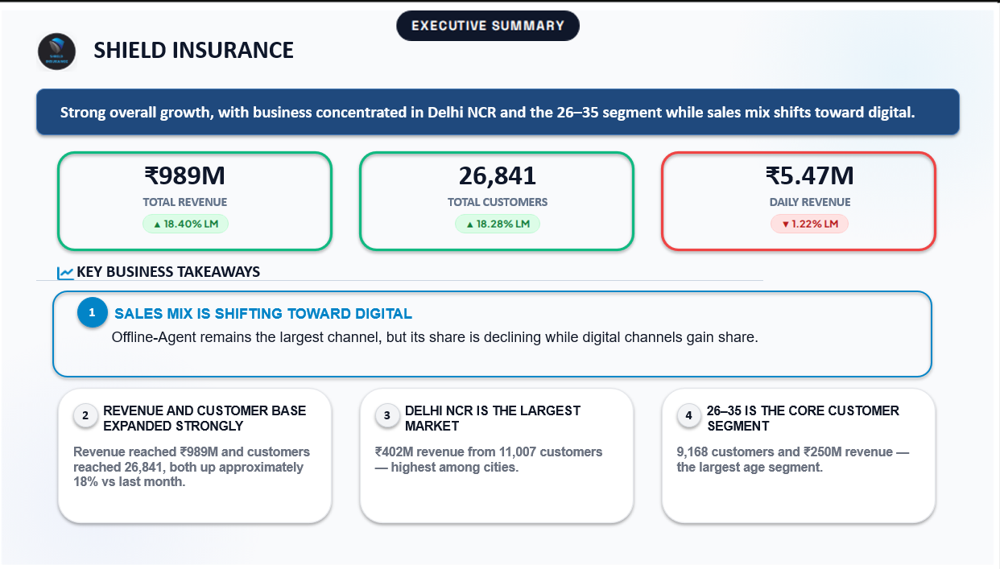
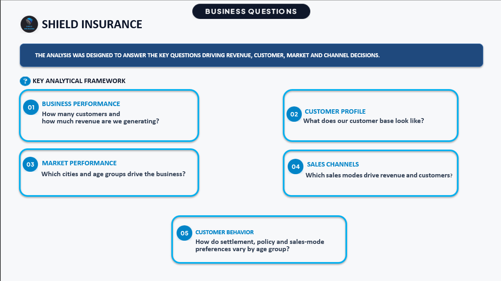
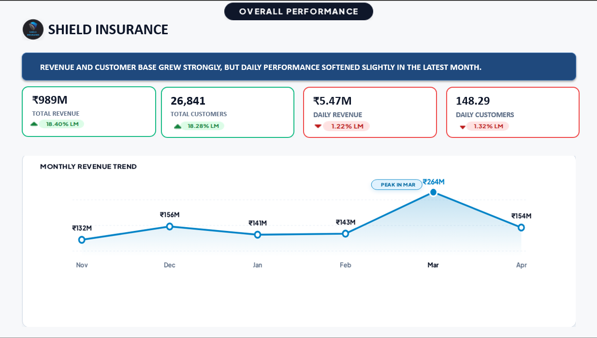
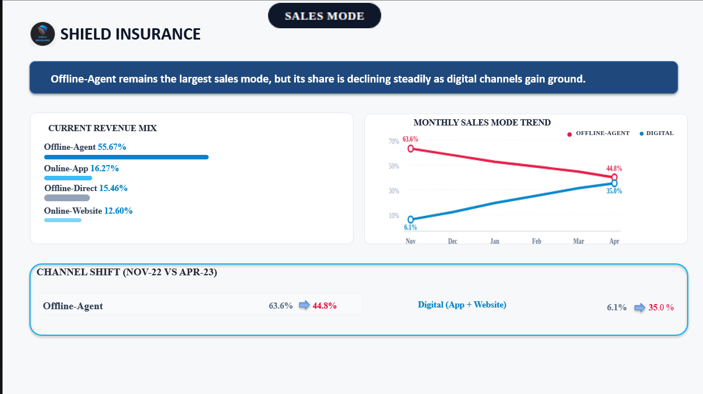
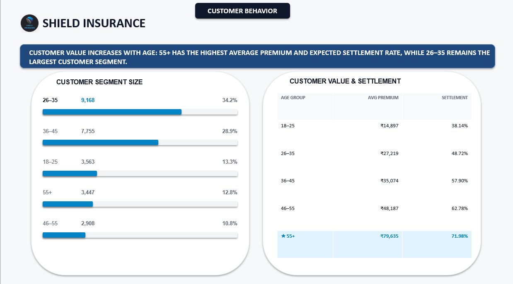
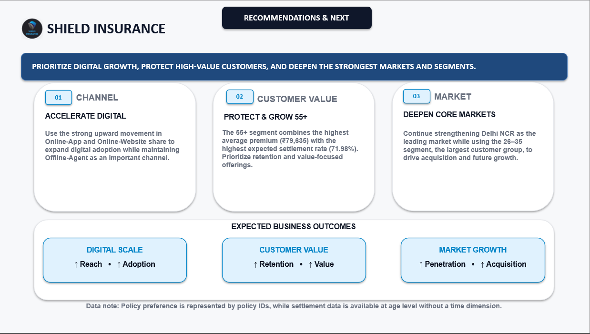

  

<h1 align="center">Shield Insurance Business Analytics</h1>
<h3 align="center">Power BI Dashboard & Stakeholder Presentation</h3>

  <a href="https://youtu.be/7iQ8janiMzI">🎥 Video Walkthrough</a> •
  <a href="https://app.powerbi.com/view?r=eyJrIjoiMDBiZGQyYjEtNjE4Ny00NGZjLWI2ZDItMTY1M2I1MDgyYjI3IiwidCI6ImM2ZTU0OWIzLTVmNDUtNDAzMi1hYWU5LWQ0MjQ0ZGM1YjJjNCJ9">📊 Live Dashboard</a> •
  <a href="#dashboard-preview">🖼️ Dashboard Preview</a> •
  <a href="Shield_Insurance_Project_Report.pdf">📄 Full Project Report</a>

---

## Executive Summary

Shield Insurance, via a pilot-project brief from Business Analyst **Mathew**, needed a way to understand revenue and customer performance, sales-channel effectiveness, market concentration, and customer behavior across age groups — and to turn that into decisions, not just charts.

This project covers the **full analytics lifecycle**: a client requirement email → a structured, prioritized feature list → locked page mockups → a verified Power BI data model and DAX layer → a 4-page interactive dashboard → an 8-slide stakeholder presentation (7 analytical slides + 1 Thank You slide) with a matching speaking script → a recorded video walkthrough.

**Headline result:** Revenue reached **₹989M** from **26,841 customers** (both up ~18% MoM). The sales mix is shifting from Offline-Agent toward digital channels, Delhi NCR leads all markets, and the 55+ age group — while only 12.8% of customers — drives 27.8% of revenue, making it the standout high-value segment.

---

## Table of Contents

- [Business Problem](#business-problem)
- [Objective](#objective)
- [Dataset](#dataset)
- [Tools & Tech](#tools--tech)
- [Workflow](#workflow)
- [Business Questions Answered](#business-questions-answered)
- [Key Insights](#key-insights)
- [Business Recommendations](#business-recommendations)
- [KPI Impact](#kpi-impact)
- [Business Impact](#business-impact)
- [Dashboard Preview](#dashboard-preview)
- [How to Access](#how-to-access)
- [Known Limitations](#known-limitations)
- [Future Work](#future-work)
- [Author & Contact](#author--contact)

---

## Business Problem

Shield Insurance had transactional data but no consolidated view of business performance. Leadership needed to answer: How much are we generating, and from whom? Which channels and cities drive the business? How does customer value differ by age group? The brief was communicated by Mathew (Business Analyst, Shield Insurance) as a pilot engagement to build confidence in the analytics partnership before scaling further.

## Objective

Go beyond "build a dashboard" — approach the problem as a Business Analyst would: start with business questions, structure them into a traceable feature list, lock the design before building, verify every number, and end with a business narrative stakeholders can act on.

## Dataset

Five tables covering **Nov 2022 – Apr 2023** (6 months, 26,841 transactional records):

- `dim_customer`
- `dim_date`
- `dim_policies`
- `fact_premiums`
- `fact_settlements`

> **Confidentiality note:** Per internship data-confidentiality guidelines, raw datasets are **not included** in this repository. Only the data model design, DAX logic, and derived/aggregated results are shared publicly.

## Tools & Tech

`Power BI` · `DAX` · `Power Query` · `Data Modeling` · `PowerPoint` · `Business Analysis`

## Workflow

Client Email (Mathew)
↓
Structured Feature List (17 features, prioritized)
↓
Locked Mockups (3 pages)
↓
Data Model + DAX Layer
↓
4-Page Power BI Dashboard
↓
Stakeholder Presentation (8 slides + script)
↓
Power BI Service Report + Video Walkthrough

## Business Questions Answered

| Business Question | Where Answered |
|---|---|
| How much revenue and how many customers do we have? | General View — KPI cards |
| What does our customer base look like? | General View + Age Group Analysis |
| Which cities and age groups drive the business? | General View — City/Age breakdowns |
| Which sales channels drive revenue and customers? | Sales Mode Analysis |
| How do settlement, policy, and channel preferences vary by age? | Age Group Analysis |

## Key Insights

- **Revenue & growth:** ₹989M revenue, 26,841 customers, both up ~18% MoM.
- **Channel shift:** Offline-Agent share declined from **63.6% → 44.8%** (Nov–Apr), while digital channels grew from **6.1% → 35.0%**.
- **Leading market:** Delhi NCR — **₹402M revenue, 11,007 customers**.
- **Volume vs. value:** 26–35 is the largest segment by volume (**9,168 customers**); 55+ is the highest-value segment by revenue contribution relative to customer share (**27.8% of revenue from 12.8% of customers**, ₹79,635 average premium, 71.98% expected settlement).

## Business Recommendations

1. **Accelerate digital growth** — expand Online-App/Website while keeping Offline-Agent strong.
2. **Protect and grow the 55+ segment** — highest premium and settlement rate; prioritize retention.
3. **Deepen core markets** — strengthen Delhi NCR while using the 26–35 segment to drive acquisition.

## KPI Impact

| KPI | Value |
|---|---|
| Total Revenue | ₹989M (▲18.40% MoM) |
| Total Customers | 26,841 (▲18.28% MoM) |
| Digital Channel Share | 35.0% (from 6.1% six months prior) |
| Delhi NCR Revenue Share | 40.6% of total |
| 55+ Segment Value Index | ~2.2x revenue-to-customer over-index |

## Business Impact

Gives Shield Insurance stakeholders a filterable, evidence-based view to prioritize digital-channel investment, build a retention strategy for high-value customers, and focus expansion efforts on proven markets — all traceable back to specific numbers rather than anecdote.

## Dashboard Preview

  
   
  <em>General View — Key Metrics, Trend, City & Age breakdowns</em>

  
   
  <em>Sales Mode Analysis — Channel split and monthly trend</em>

  
   
  <em>Age Group Analysis — Customer behavior, settlement, and policy preference</em>

## Presentation Preview

An 8-slide stakeholder deck (7 analytical slides + 1 Thank You) — Executive Summary → Business Questions → Overall Performance → Customer & Market Analysis → Sales Mode Performance → Customer Behavior by Age Group → Recommendations & Next Steps → Thank You. Full deck: [Shield Insurance Executive Dashboard.pptx](Shield%20Insurance%20Executive%20Dashboard.pptx).

| Slide | Preview | Summary |
|---|---|---|
| **1. Executive Summary** |  | Revenue and customer base grew strongly (₹989M, 26,841 customers, both ▲~18% MoM). Key shift: sales mix moving toward digital while Offline-Agent stays dominant. Delhi NCR and the 26–35 segment are the largest concentrations. |
| **2. Business Questions** |  | Frames the 5 questions the analysis answers: business performance, customer profile, market performance, sales channels, and customer behavior by age. |
| **3. Overall Performance** |  | ₹989M revenue (▲18.40%), 26,841 customers (▲18.28%). Daily revenue and customer growth softened slightly (▼1.22%, ▼1.32%). Monthly trend peaked in March at ₹264M. |
| **4. Customer & Market Analysis** |  | Delhi NCR is the largest market — ₹402M revenue, 11,007 customers. The 55+ segment stands out as high-value: just 12.8% of customers but 27.8% of revenue. |
| **5. Sales Mode Performance** |  | Offline-Agent remains the largest channel (55.67% of revenue) but its share is declining — from 63.6% to 44.8% (Nov–Apr) — while digital channels grew from 6.1% to 35.0%. |
| **6. Customer Behavior by Age Group** |  | 26–35 is the largest segment by volume (9,168 customers, 34.2%). 55+ is the highest-value segment — ₹79,635 average premium and 71.98% expected settlement rate. |
| **7. Recommendations & Next Steps** |  | Three actions: accelerate digital growth, protect and grow the 55+ segment, and deepen core markets (Delhi NCR + 26–35 acquisition). Expected outcomes: digital scale, customer value, market growth. |

## How to Access

- 🎥 **Video walkthrough (public presentation):** [youtu.be/7iQ8janiMzI](https://youtu.be/7iQ8janiMzI)
- 📊 **Live Power BI dashboard:** [Open live report](https://app.powerbi.com/groups/me/reports/9258cdb3-48ba-4dcd-bedb-755bdaeb1678/818c6d745e98be4c08e2?experience=power-bi) *(personal workspace — requires sign-in / access)*
- 📄 **Full technical write-up:** [Shield_Insurance_Project_Report.pdf](Shield_Insurance_Project_Report.pdf)
- 🖥️ **Presentation deck:** [Shield Insurance Executive Dashboard.pptx](Shield%20Insurance%20Executive%20Dashboard.pptx)

> Raw datasets are **not published** in this repository in accordance with the internship's data-confidentiality guidelines.

## Known Limitations

- `policy_id` is used instead of named policy categories in the Policy Preference visual because the source data does not contain a policy-type/category column.
- Settlement data (`fact_settlements`) has no date dimension, so settlement trends over time cannot be analyzed; only a static, age-level view is available.

## Future Work

- Map `policy_id` to named policy categories, subject to client input.
- Add a time dimension to settlement data to enable trend analysis.
- Apply row-level security if the report is shared across regional stakeholders.
- Automate refresh once the client moves to a live data source.

## Author & Contact

**Sahajahanur Rahman Laskar**

📧 [connectingsrl@gmail.com](mailto:connectingsrl@gmail.com)
🔗 [LinkedIn](https://www.linkedin.com/in/sahajahanur-laskar/) · [GitHub](https://github.com/Sahajahanur)

*Built as part of the Codebasics Data Analyst Virtual Internship — AtliQ Technologies Pvt. Ltd.*
